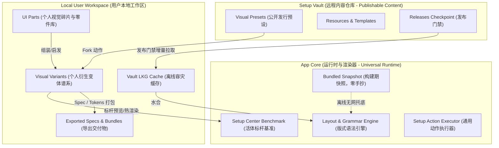
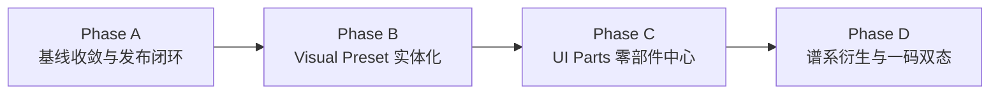

# Setup Center — Target Product Architecture

> **架构性质**：未来产品重构规范与领域蓝图（Target Architectural Specification）  
> **设计依据**：[`SETUP_CENTER_PRODUCT_VISION.md`](./SETUP_CENTER_PRODUCT_VISION.md) 与 [`PRODUCT_GAP_ANALYSIS.md`](./PRODUCT_GAP_ANALYSIS.md)  
> **核心原则**：不为了架构漂亮虚增抽象；以“发现 → 收集 → 理解 → 组装 → 修改 → 预览 → 导出 → 复用”为主线；明确数据归属与运行边界。

---

## 1. 目标产品模型（Target Product Model）

未来的 Setup Center 从定位上定型为 **面向个人创作者与开发者的系统级灵感与研发工作台（Creative & Development Workbench）**。

### 1.1 核心领域对象矩阵（Domain Objects & Boundaries）

系统拒绝无意义的万物对象化，确立以下一等领域对象与从属元数据：

| 领域对象 | 对象定位 | 主要所有权边界 | 存储形态 | 职责定义 |
| :--- | :--- | :--- | :--- | :--- |
| **UI Part** | **一等公民 (Domain Object)** | Local Workspace (个人专属)<br>可提交入 Vault | 本地文件系统 / JSON + 媒体文件 | 视觉与交互的最小灵感原子（截图、卡片、代码片段、动效模式）。支持从未加工到深度结构化。 |
| **Visual Preset** | **一等公民 (Domain Object)** | Setup Vault (公共真理源)<br>可本地只读离线快照 | Vault 独立资产目录（清单 + CSS + 规范） | 完整的视觉交互系统（不仅是主题换肤），涵盖全套排版、版式语法、组件律动与约束规范。 |
| **Visual Variant** | **一等公民 (Domain Object)** | Local Workspace (本地衍生) | 本地工作区 JSON + Delta 补丁 | 用户基于 Visual Preset 或其他 Variant 派生的定制变体，维持单向谱系追踪（Lineage）。 |
| **Design Spec** | **导出型产物 (Artifact / View)** | 由 Preset / Variant 动态生成 | Markdown / HTML / W3C Tokens | 视觉系统的可交付说明书，面向人类设计师与 AI 编码代理（Agent）。 |
| **Resource** | **内容资产 (Content Asset)** | Setup Vault (公开发布源) | Vault JSON Catalog | 高价值第三方项目、文档、工具与灵感站外链。 |
| **Template** | **内容资产 (Content Asset)** | Setup Vault (公开发布源) | Vault JSON + 脚手架契约 | 工程化初始化样板（Starter kits / Scaffolds）。 |
| **Software / Env** | **底层能力 (Machine Substrate)** | App Runtime + 本地环境 | Tauri Rust 内核 + 系统事实 | 宿主开发环境探测、包管理器调度与安装器执行。 |

### 1.2 物理归属与三层数据边界



---

## 2. 重点模型：UI Part（渐进式零部件）

UI 不是普通的只读 Resource，而是用户的灵感与零件积木。

### 2.1 渐进式结构化数据模型（Progressive Enrichment Contract）

用户在抓取灵感时不能被繁琐的表单阻碍；系统必须允许以「一张截图 + 一个链接」建立条目，并在后续使用或 AI 介入时逐步丰富。

```typescript
export type UIPartStage = "raw" | "analyzed" | "structured" | "componentized";

export interface UIPart {
  /** 唯一标识，例如 "uipart:loc:20261004-9a8f" */
  id: string;
  /** 渐进阶段：未加工 → 已分析 → 结构化 → 组件化 */
  stage: UIPartStage;
  
  // ── 最小有效状态 (Raw State - 抓取即可入库) ──
  title: string;
  sourceUrl?: string;
  imagePath: string;            // 本地截图或图片相对路径
  tags: string[];               // 自由分类标签，例如 ["navigation", "bento", "retro"]
  note?: string;                // 用户的个人一句话备忘
  createdAt: string;
  updatedAt: string;

  // ── 逐步丰富字段 (Enriched Fields - 可选增量填充) ──
  visualLanguage?: {
    family?: string;            // 例如 "Industrial", "Editorial", "Cyber"
    atmosphere?: string;        // 氛围感知描述
    targetUseCases?: string[];  // 推荐场景，例如 ["dashboard", "landing-page", "poster"]
  };

  analysis?: {
    layoutType?: string;        // 网格、流式、绝对定位、堆叠
    compositionNotes?: string;  // 构图比例与留白法则
    typographyNotes?: string;   // 字体搭配与阶梯
    interactionNotes?: string;  // 动效节奏与反馈特性
  };

  extractedTokens?: {
    palette?: string[];         // 提取的主辅色板
    radius?: string;            // 圆角倾向
    border?: string;            // 边框质感
    shadow?: string;            // 阴影特征
  };

  implementation?: {
    htmlSnippet?: string;
    cssSnippet?: string;
    reactCode?: string;
    svgAssets?: string[];
  };

  portablePrinciples?: string[]; // 可提炼的设计法则（Do / Don't）
}
```

### 2.2 UI Part 生命周期

1. **Quick Capture**：通过剪贴板截图或 URL 快速生成 `stage = "raw"` 的条目。
2. **AI Assist / Manual Breakdown**：点击「分析解构」，提取调色板、版式规律、字阶层次，状态晋升为 `analyzed`。
3. **Specification & Code Extraction**：编写或生成 CSS/React 片段与 Tokens，状态晋升为 `componentized`。
4. **Assembly into System**：勾选多个 UI Part，一键「合成为 Visual Preset 草案」。

---

## 3. 重点模型：Visual Preset（完整视觉系统）

Visual Preset 绝非一张 CSS 样式表或调色板，而是**可以移植到任何软件项目中的完整视觉系统**。

### 3.1 完整数据契约

```typescript
export interface VisualPresetSystem {
  id: string;
  version: string;
  name: string;
  subtitle: string;
  author: string;
  description: string;
  
  // 1. 系统核心意图与适用面
  intent: {
    philosophy: string;          // 核心设计理念
    atmosphere: string;          // 情绪基调
    visualFamily: string;        // 语族归属 (Editorial / Industrial / Minimal...)
    useCases: string[];          // 适配场景 (Software / PPT / Landing / Poster / Tool)
    antiUseCases: string[];      // 不适宜场景与禁忌
  };

  // 2. 版式与宏观语法 (Macro Grammars)
  grammar: {
    shell: string;               // 视窗骨架 (sidebar / topbar / dock / canvas...)
    navigation: string;          // 导航形态 (tab-strip / command-bar / rail...)
    detail: string;              // 详情展开 (rail / modal / sheet / floating...)
    card: string;                // 容器卡片语法 (panel / editorial-block / poster...)
    composition: string;         // 列表编排韵律 (solid-grid / magazine-index / ledger...)
    density: "compact" | "normal" | "spacious";
    motion: "reduced" | "normal" | "expressive";
  };

  // 3. 物理与视觉原子 (Design Tokens)
  tokens: {
    palette: {
      background: string;
      surface: string;
      surfaceRaised: string;
      border: string;
      textPrimary: string;
      textSecondary: string;
      accent: string;
      accentSecondary?: string;
    };
    geometry: {
      panelRadius: string;
      controlRadius: string;
      borderWidth: string;
    };
    shadows: {
      elevationNormal: string;
      elevationHard: string;
    };
    typography: {
      headingFont: string;
      bodyFont: string;
      monoFont: string;
      headingScaleRatio: number;
      bodyScaleRatio: number;
    };
  };

  // 4. 组件规范与交互细节 (Component Specs)
  components: {
    buttonRules: string;
    inputRules: string;
    listRules: string;
    modalRules: string;
  };

  // 5. 转移法则与规范 (Transferable Specifications)
  transferRules: {
    portableIdeas: string[];     // 可直接搬去下一个产品的精髓
    constraints: string[];       // 维持此风格不可打破的物理铁律
  };

  // 6. 活体样式表与静态资源
  stylesheetCss: string;         // 供 Benchmark 渲染的 CSS
  boundPartIds?: string[];       // 关联的 UI 零部件来源
}
```

### 3.2 现有契约去留与重构结论

- **保留**：
  - `ExperienceProfile` 中的 closed-enum 版式语法（`shell`, `nav`, `detail`, `card`, `composition`）非常成功，保持为 Setup Center Benchmark 活体渲染的驱动核心。
  - `TokenOverrides` 机制：用于表达用户与预设之间的差值（Delta）。
- **扩展**：
  - `SetupStyle` 必须扩展 `intent`（语族、适用场景）、`transferRules`（设计法则、约束）、`boundPartIds`（关联零部件）。
- **废弃**：
  - 彻底废除 `VaultStyleManifest` 中旧版扁平弱类型结构（纯 `palette` + 孤立 `tokens`），远端统一收敛于标准 `VisualPresetSystem` 清单。
  - 禁止将样式仅视为本地静态 CSS 文件。

---

## 4. Fork / Variant 谱系模型（Lineage Architecture）

系统不需要实现庞杂的 Git 树，但必须建立严格的**单向血统记录（Unidirectional Lineage）**。

### 4.1 数据结构

```typescript
export interface VisualVariant {
  /** 变体 ID: "var:usr:<sourceId>:<slug>" */
  id: string;
  name: string;
  
  /** 血统追踪 (Lineage) */
  lineage: {
    rootPresetId: string;       // 根预设 ID，例如 "desktop-studio"
    rootPresetVersion: string;  // 派生时的根版本号
    parentId: string;           // 直接父级 ID（支持从变体再派生变体）
    depth: number;              // 谱系深度 (0: 预设本身, 1: 一级派生, 2: 变体的变体...)
  };

  metadata: {
    createdAt: string;
    updatedAt: string;
    author: string;
    notes?: string;             // 用户对这次修改的意图记录
  };

  /** 差异补丁 (Patch Delta) - 不存完整副本，只存对父级的覆写 */
  changes: {
    tokenDelta: Partial<VisualPresetSystem["tokens"]>;
    grammarOverrides?: Partial<VisualPresetSystem["grammar"]>;
    customCssSnippet?: string;
  };

  /** 资产与零件绑定 */
  boundParts: string[];         // 该变体引用或吸纳的 UI Part ID 列表
}
```

### 4.2 衍生生命周期

```text
Visual Preset (e.g. Desktop Studio) [Vault]
    │
    ├── Fork 动作
    ▼
Visual Variant A (e.g. My Competition Studio) [Local]
    │
    ├── 深度微调 + 绑定 3 个 UI 零件
    ├── Fork 动作
    ▼
Visual Variant A-1 (e.g. Dark Minimal Sub-variant) [Local]
```

---

## 5. 导出即交付物（Export as the End Product）

Setup Center 的终极价值在于 **“看见 → 理解 → 调整 → 带走”**。

系统必须提供 4 种一键导出规格：

1. **Human Design Specification (`spec.md`)**：
   - 包含视觉意图、语族特征、排版与网格比例、全局色板说明、组件交互准则、适用与禁用场景。
2. **Agent Implementation Spec (`agent-brief.md`)**：
   - 专为 Claude / Gemini / Codex 优化的结构化 Prompt 规范，包含确定的原子类名规则、CSS 变量表、语义化 HTML 骨架结构与不可违背的约束，使 Agent 能在全新项目中像素级还原该风格。
3. **Design Tokens (`tokens.json` & `tokens.css`)**：
   - 标准 W3C Design Tokens 格式 JSON，以及纯 CSS 自定义属性表与 Tailwind 配置扩展对象。
4. **Portable Preset Archive (`.scpreset` / Zip)**：
   - 包含 `manifest.json`、`spec.md`、`tokens.json`、`styles.css` 与关联 UI Parts 截图的独立归档包。

---

## 6. Personal 与 Distribution 双形态架构（One-Codebase Multi-Profile）

避免维护长期发散的 Git 分支。采用**同构内核 + 编译/启动期 Feature Profile** 控制。

### 6.1 配置文件规范

```typescript
export type ProductProfileMode = "personal" | "distribution";

export interface ProductProfileConfig {
  mode: ProductProfileMode;
  appName: string;
  features: {
    uiPartsLibrary: boolean;      // 零部件收集与管理
    visualLabAdvanced: boolean;   // 高级规范与变体管理
    systemExport: boolean;        // 完整 Spec / Token 打包导出
    transferInbox: boolean;       // 网页捕获流转箱
    softwareInstaller: boolean;   // Windows 本地软件安装与向导
    environmentProbing: boolean;  // 硬件与 PATH 探测
  };
  navigation: {
    visibleSections: string[];
    defaultSection: string;
  };
}

export const PROFILE_CONFIGS: Record<ProductProfileMode, ProductProfileConfig> = {
  personal: {
    mode: "personal",
    appName: "Setup Center — Creative Workbench",
    features: {
      uiPartsLibrary: true,
      visualLabAdvanced: true,
      systemExport: true,
      transferInbox: true,
      softwareInstaller: true,
      environmentProbing: true,
    },
    navigation: {
      visibleSections: ["workbench", "ui-parts", "presets", "resources", "templates", "software", "system"],
      defaultSection: "workbench",
    },
  },
  distribution: {
    mode: "distribution",
    appName: "Setup Center",
    features: {
      uiPartsLibrary: false,
      visualLabAdvanced: false,
      systemExport: false,
      transferInbox: false,
      softwareInstaller: true,
      environmentProbing: true,
    },
    navigation: {
      visibleSections: ["overview", "software", "environment", "resources", "templates", "about"],
      defaultSection: "overview",
    },
  },
};
```

### 6.2 零 `if (personal)` 散落原则

- 页面与组件严禁散落 `if (profile === "personal")`。
- 导航由 `activeProfile.navigation.visibleSections` 声明式渲染。
- 功能卡片与操作由 `activeProfile.features.<featureKey>` 通过守卫原语 `<FeatureGuard feature="systemExport">` 进行包裹。

---

## 7. 远端 Vault 与本地存储边界重构

### 7.1 明确边界分工

- **App 仓库（`setup-center`）**：
  - 纯粹的 **通用运行时（Universal Runtime）**。
  - 拥有渲染器、版式语法规则表、基准标杆表面、基本 UI 控件原语、本地工作区读写器。
- **Vault 仓库（`setup-center-vault`）**：
  - 纯粹的 **可发布内容目录（Publishable Content Registry）**。
  - 拥有经过验证的 Visual Presets、Resources、Templates、Starter Packs。
- **本地工作区（`Local User Workspace`）**：
  - 存放用户的私有 UI Parts、本地 Variants、操作日志、离线缓存。

### 7.2 杜绝手工双份维护：构建期快照生成管线

```text
[日常发布]
Vault 仓库 (main) ──> 验证测试 ──> 打 Tag ──> release checkpoint (releases/latest.json)

[客户端打包]
scripts/bundle-vault-snapshot.mjs
    │ (读取指定 Pinned Tag)
    ▼
src/generated/vault-snapshot.json
    │ (Vite 打包进安装包)
    ▼
零手写重复代码，断网环境下开箱即用完整的稳定预设与资源！
```

---

## 8. 未来主信息架构（Information Architecture）

以 **个人创作工作台（Personal Edition）** 为第一优先级的全新信息架构设计（彻底摒弃聊天框优先与线性安装向导优先）：

```
Setup Center (Personal Workbench)
│
├── 1. 灵感与零件 (Inspiration & Parts)
│   ├── [UI Parts] 视觉零部件库 (Raw 截图 / 网页灵感 / 拆解卡片 / 渐进沉淀)
│   └── [Inbox] 流转收集箱 (外部 URL 快速抓取、标准化与待处理清单)
│
├── 2. 视觉系统 (Visual Systems)
│   ├── [Visual Presets] 预设系统画廊 (按语族 / 场景无目的浏览、活体标杆基准)
│   ├── [My Variants] 个人衍生变体库 (谱系追踪、本地调校、对比父级)
│   └── [Export Studio] 导出工作台 (生成 Human Spec / Agent Brief / Tokens / 离线包)
│
├── 3. 研发资源 (Engineering Hub)
│   ├── [Resources] 开发者精选 (开源生态、字体、图标、动效库、工具)
│   └── [Templates] 项目脚手架 (Starter Kits、一键克隆与初始化)
│
└── 4. 机器底座 (Machine & Environment)
    ├── [Software] 软件矩阵 (本机装配感知、Winget 发现、批量交付)
    ├── [Environment] 运行环境配置 (PATH、Git 身份、代理、运行时版本)
    └── [Settings] 系统偏好 (产品画像切换、Vault 数据源、存储与更新)
```

---

## 9. 四阶段极简落地路线图（4-Stage Roadmap）

拒绝长篇大论的碎片 Phase，聚焦 4 个关键攻坚阶段：



### Phase A：基线收敛与发布闭环（Runtime & Build Closure）
- **为什么现在做**：当前三方分支严重漂移，本地 localhost 与 EXE 版本撕裂，URL 404，发布门禁存在穿透漏洞。不收敛基线，后续任何开发都是在流沙上建塔。
- **完成标准**：
  1. 梳理合并分支资产（旗舰风格与批量预设），统一主线基准。
  2. 修复硬编码 URL（指向 `Arukasaeled` 官方命名空间）。
  3. 修复 Vault 门禁穿透漏洞与冷启动异步水合回退 Bug。
  4. 恢复画廊无目的沉浸流动（移除破坏体验的 6-item 强分页）。
  5. 产出可复现、版本一致的本地 Release EXE 与 dev 环境。
- **明确禁止**：不新增新页面，不重写大模块。

### Phase B：Visual Preset 领域实体化（Visual Preset as Real Domain）
- **为什么现在做**：视觉系统是核心差异化能力，但目前仅作为应用内部换肤存在，无法对外导出交付。
- **完成标准**：
  1. 升级 `VisualPresetSystem` 契约，补齐语族、适用场景与设计约束。
  2. 实现 Human Design Spec (`.md`) 与 Agent Implementation Spec (`.md`) 确定性导出引擎。
  3. 实现标准 Design Tokens 导出。
- **明确禁止**：不搞复杂的在线富文本设计器，不侵入底层安装器。

### Phase C：UI Parts 零部件中心（UI Parts Library）
- **为什么现在做**：落实「UI stores parts, not complete systems」的愿景基石，打通从灵感到系统的原料层。
- **完成标准**：
  1. 建立 `UIPart` 渐进式结构（本地 JSON + 媒体存储）。
  2. 实现 UI 零部件无目的漫步浏览与快速图文录入。
  3. 支持将零部件与 Visual Preset 变体进行关联绑定。
- **明确禁止**：不做强制性的全字段结构化验证，保护零门槛快速捕获体验。

### Phase D：谱系衍生与一码双态（Fork / Variant & Profiles）
- **为什么现在做**：完成从单人工具向产品化工作台的跨越，彻底解决个人版与公开分发版的长期维护冲突。
- **完成标准**：
  1. 实现 `VisualVariant` 谱系管理与增量 Delta 存储。
  2. 接入 `ProductProfileConfig`，一键编译/切换 Personal 与 Distribution 体验。
  3. 建立 Vault 自动化快照打包脚本（彻底消除 App 内部手写重复内置数据）。
- **明确禁止**：不实现完整的 Git 合并/冲突解决引擎，保持轻量级谱系。
