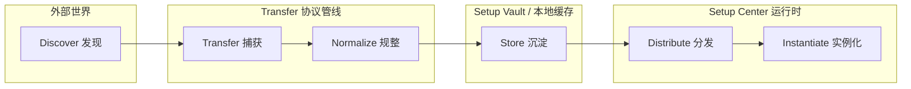
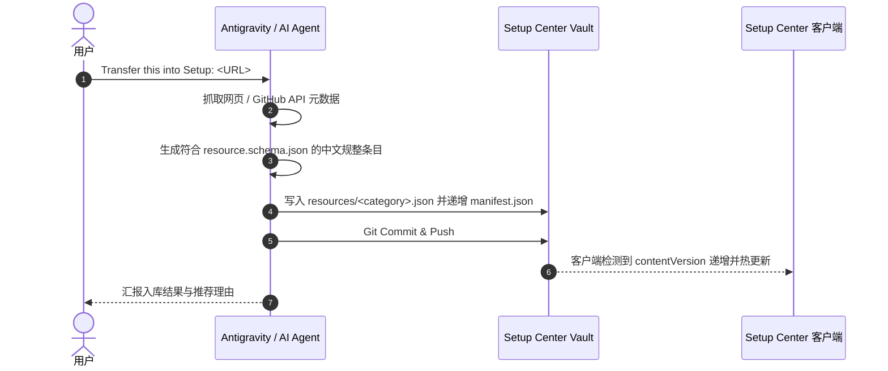

# Setup Center — Transfer Protocol & Guide

> **Transfer**: Discover → Transfer → Normalize → Store → Distribute → Instantiate.
>
> Setup Center 不再只是一个 Windows 软件安装器，而是 **Creative & Development Bootstrap Hub**。
> 本协议定义了外部工具、设计灵感、代码模版与开发资产如何无缝流转进入 Setup Center 生态。

---

## 1. 核心流转生命周期 (Transfer Lifecycle)

1. **Discover (发现)**：在 GitHub、技术社区、设计画廊（Godly、Awwwards）、博客中发现高价值创作或开发资产。
2. **Transfer (捕获)**：通过 UI 收集箱（Transfer Inbox）或向 Agent 发出指令：“Transfer this into Setup: `<URL>`”。
3. **Normalize (规整)**：根据 JSON Schema 将原始网页或仓库信息标准化（抽取名称、中文描述、组织、许可证、Star 数、推荐理由、分类标签与操作类型）。
4. **Store (沉淀)**：提交至独立远程仓库 `setup-center-vault` 或存入客户端离线缓存，与应用主代码完全解耦。
5. **Distribute (分发)**：客户端在启动或点击「同步 Vault」时通过增量清单无缝拉取最新数据。
6. **Instantiate (实例化)**：用户在客户端中一键应用设计系统、通过工程脚手架初始化项目、或直接下载离线资产。

---

## 2. Agent 交互协议 (Agent Workflow Recipe)

当用户对 AI Agent 说：
> **“Transfer this into Setup: `https://github.com/astral-sh/uv`”**

Agent 执行以下确定性步骤：

### 规范检查清单 (Normalization Checklist)
- `id`: 格式统一为 `res:vault:<slug>` 或 `tpl:<slug>`。
- `name`: 官方规范名称（大小写保持精准）。
- `category`: 精准归入现存分类（`frontend`、`components`、`animation`、`icons`、`fonts`、`tools`、`ai`、`templates`、`learning`、`collections`）。
- `description`: 20-50 字凝练中文说明。
- `recommendedReason`: 核心痛点与不可替代的推荐价值。
- `actionType`: `github`（源码仓库）、`external`（官网体验）、`download`（直接下载）。

---

## 3. 零编译热扩充 (Zero-Rebuild Extension)

Setup Center App 实现了真正的 **运行时内容热更新 (Runtime Content Update)**：
- **静态资源自动发现**：前端通过 Vite `import.meta.glob("./categories/*.ts")` 实现本地零修改扩充。
- **动态资源热加载**：远程 Vault 数据通过 `VaultSync` 增量拉取，直接注入 `ContentRegistry` 与 `RESOURCE_CATALOG`。
- **动态样式挂载**：Vault 中的 CSS 样式通过动态 `<style id="vault-style-${id}">` 标签即时注入 DOM，完全不需要重新打包可执行文件。

---

## 4. 离线优先与容灾回退 (Offline-First Resilience)

- **无网络环境**：客户端启动时优先激活 `setup-center.vault-cache.v1` 本地快照，即使断网界面依然完整。
- **清单损坏防护**：如果远端返回非法 JSON 或网络连接超时，系统自动保留上一份有效快照，绝不引发界面空白或奔溃。
- **自定义数据源**：支持通过设置自定义 Vault Remote URL（私有镜像源、本地 Mock 服务器或内网 GitLab）。

---

## 5. Release-Gated 批次发布门禁 (Release-Gated Updates)

Setup Center 确立了严格的双通道更新模型：

1. **App Release (程序本体通道)**：
   - 承载：Tauri 跨平台窗口、Rust 硬件探测内核、安装调度引擎与基础渲染器。
   - 机制：通过 GitHub Releases / 官方安装包发布，客户端在 TitleBar 版本徽标提示更新。
2. **Vault Release (内容资产通道)**：
   - 承载：设计系统 Style、开源资源、项目脚手架与交互范式。
   - 门禁机制：Vault 仓库的 `main` 分支作为日常资产捕获与规整工作区（Staging），不直接无脑推给用户；仅当沉淀为稳定批次并在 `releases/latest.json` 生成 Checkpoint 时，客户端才提示发现新内容批次。
   - 价值：允许高频扩充内容而绝不骚扰用户，同时为终端提供极速增量热同步。

